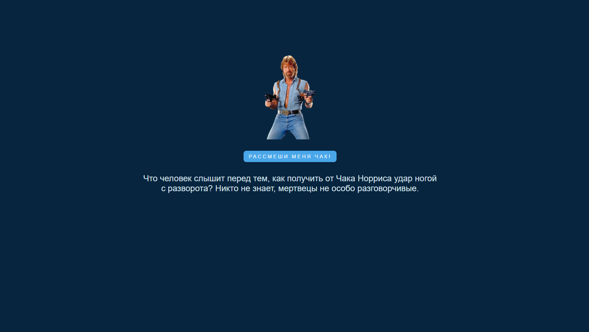

# random-jokes

## Описание проекта

Random Jokes - один из проектов по JavaScript популярного бесплатного англоязычного курса freeCodeCamp. Проект предназначен для получения первого опыта работы с API - асинхронного получения данных и отображения их на странице

<kbd></kbd>

- Вёрстка состоит из одного главного блока: `
`

[Деплой проекта](https://zixail28.github.io/random-jokes/)  
